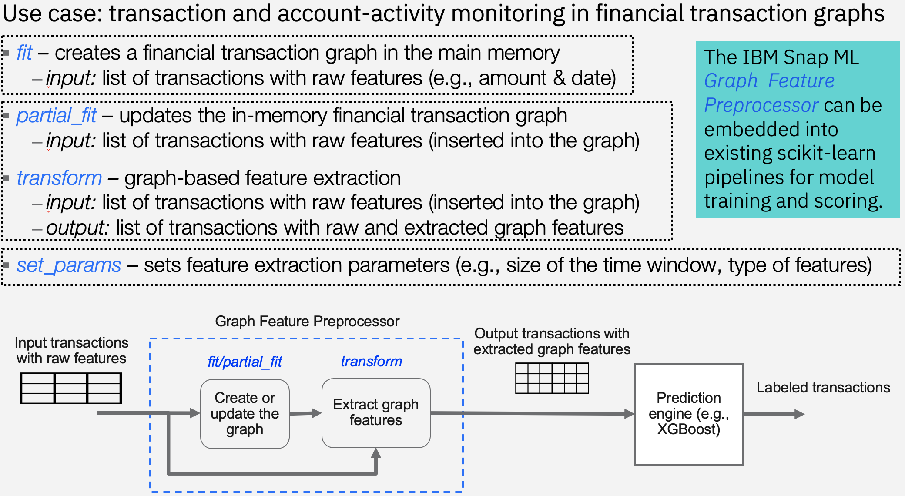

Graph Feature Preprocessor
============================

The GraphFeaturePreprocessor is a scikit-learn compatible preprocessor that enables scalable and real-time feature extraction from graph-structured data.  
It provides utilities for creating and updating in-memory graphs as well as extracting new features from these graphs. 
The basic input and output data representation used by GraphFeaturePreprocessor is an edge list with edge features.
As an example, in a financial transaction graph, the graph nodes represent accounts and the graph edges represent transactions.
The date of the transactions as well as the amount transferred between the accounts may be provided as edge features.
However, the GraphFeaturePreprocessor can generate a much richer set of edge features by analyzing the graph topology and extracting meaningful substructures.   
For instance, the GraphFeaturePreprocessor can extract the number of cycles each transaction is part of in the graph.
Such additional features can significantly increase the predictive power of machine learning models in practical settings,
e.g., when monitoring suspicious transactions and account activities in financial transaction graphs. 

The current version of the GraphFeaturePreprocessor is specialised to operate on temporal graphs. 
More specifically, the graph edges must have timestamps. Furthermore, each edge must have a unique id. 
The edge list must be provided as a two dimensional numpy array of floating point numbers.
The first column must be `Edge id`, the second `Source vertex id`, the third `Target vertex id`, and the fourth `Timestamp`.     
Additional columns can be used to store more edge features. An example edge list is shown in the below table.

+-------------------+-------------------+-------------------+-------------------+------------------+-------------------+
| Edge id           | Source vertex id  | Target vertex id  | Timestamp         |  Other Feature   | Other Feature     |
+===================+===================+===================+===================+==================+===================+
| 1000              | 1                 | 2                 | 10                |                  |                   |
+-------------------+-------------------+-------------------+-------------------+------------------+-------------------+
| 3000              | 3                 | 4                 | 20                |                  |                   |
+-------------------+-------------------+-------------------+-------------------+------------------+-------------------+
| 2000              | 1                 | 4                 | 20                |                  |                   |
+-------------------+-------------------+-------------------+-------------------+------------------+-------------------+
| 4000              | 3                 | 2                 | 30                |                  |                   |
+-------------------+-------------------+-------------------+-------------------+------------------+-------------------+

The edge list must be sorted in the ascending order of the timestamps for best performance. 
An in-memory directed multi-graph representation will be created internally when an edge list is provided as input to the `fit` function.
The `transform` function, on the other hand, receives an edge list as input, inserts these edges into the in-memory graph,
and extracts new features from the graph, which are appended to the input edge list as additional columns to form the output of this function.   
The output edge list is again a two dimensional numpy array of floating point numbers, however, with additional columns to store the new features.

.. autoclass:: snapml.GraphFeaturePreprocessor
   :inherited-members:
   :members:
